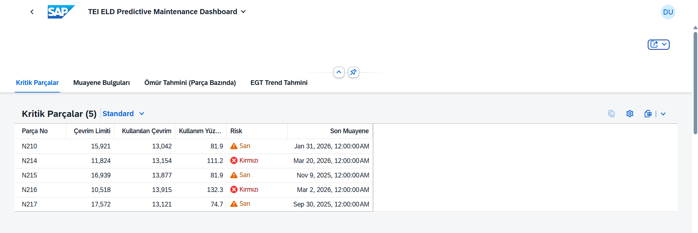
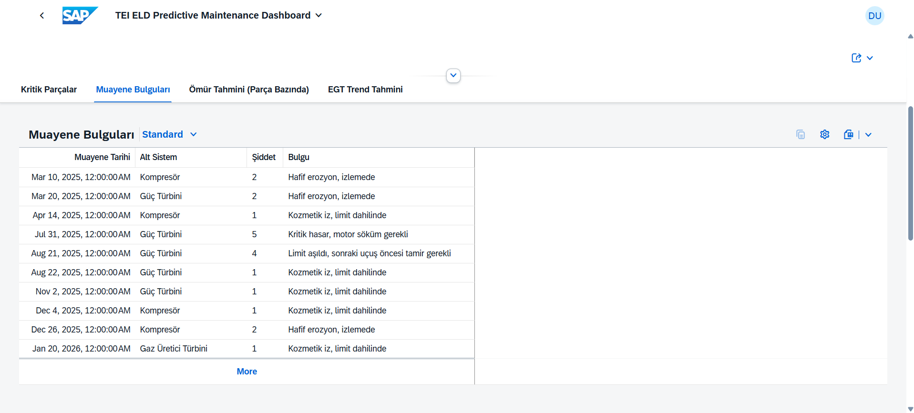
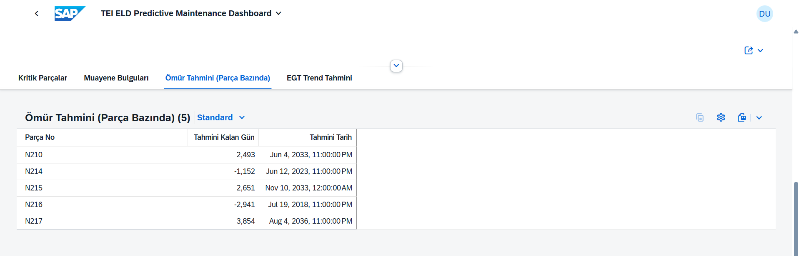
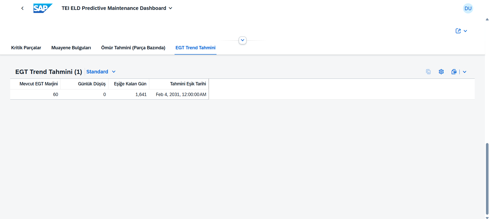
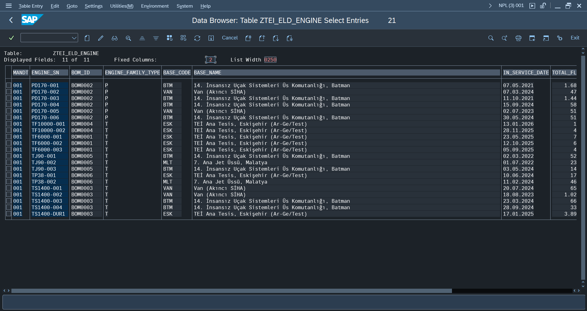
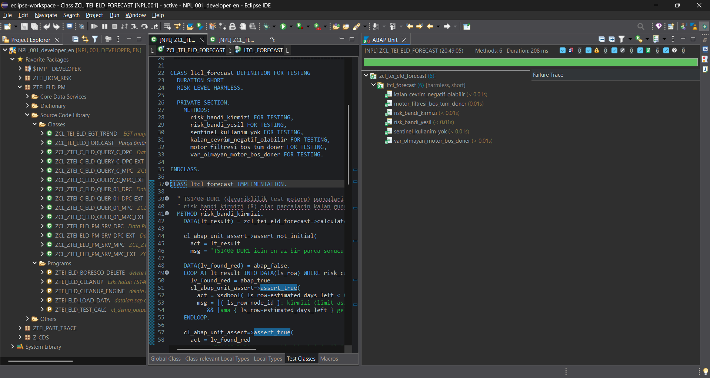

# TEI ELD Kestirimci Bakım Gösterge Paneli

*English version: [README.md](README.md)*

Uçak motoru filosu için kestirimci bakım (predictive maintenance) gösterge paneli — SAP Fiori Elements **Analytical List Page + Object Page** üzerine, klasik **CDS view'lar**, **ABAP Unit test'li ABAP tahmin/trend sınıfları** ve klasik **SEGW OData V2** servisiyle inşa edildi.

[tei-part-traceability-portal](https://github.com/BarisDursun/tei-part-traceability-portal) ve [tei-bom-embargo-risk-simulator](https://github.com/BarisDursun/tei-bom-embargo-risk-simulator)'dan sonra üçüncü SAP Fiori/ABAP portföy projesi. Bilinçli olarak proje 2'nin filosunu (TF6000, PD170, TS1400, TF10000, TJ90, TP38) ve BOM verisini yeniden kullanıyor; fiziksel, seri numaralı motor örneklerini o mevcut parça modellerine bağlıyor — üç ayrı demo yerine üç proje boyunca entegre bir mini-ERP anlatısı kurma denemesi.

## Ekran Görüntüleri

| | |
|---|---|
|  |  |
| Analytical List Page — grafik + tablo bir arada, en riskli en üstte | Object Page — kritik (LLP) parçalar, renkli risk göstergesi |
|  |  |
| Borescope muayene geçmişi | Parça bazında ömür tahmini — projenin "kestirimci" tarafının karşılığı |
|  |  |
| EGT marjini düşüş trendi | Filtre barı kullanımda |
|  |  |
| Z-tablolarındaki gerçek üretilmiş veri | ABAP Unit test çalıştırması — 10/10 yeşil |

## Neden bu proje

1. ve 2. projeler klasik CRUD ve hiyerarşik/recursive OData kalıplarını kanıtladı. Bu proje bilinçli olarak farklı bir SAP yetkinliğini hedefliyor: **Fiori Elements Analytical List Page'i besleyen analitik CDS view'lar**, ve gerçekten *kestirimci* (sadece tanımlayıcı değil) iş mantığı — ömür sınırlı bir parçanın çevrim limitine ne zaman ulaşacağını hesaplayan bir sınıf, ve bir motorun EGT marjinin ne zaman Hot Section Inspection eşiğini aşacağını hesaplayan başka bir sınıf.

## Mimari

```
ztei_eld_engine / ztei_eld_part_li / ztei_eld_usage_l / ztei_eld_boresco   (Z-tablolar)
        │
        ▼
ZTEI_I_ELD_FLEET_HEALTH  ─┐
ZTEI_I_ELD_PART_USAGE     │  CDS: basic → composite → dashboard katmanlaması
ZTEI_I_ELD_PART_RISK      │  (neden duzlestirilmedigi icin asagidaki
ZTEI_C_ELD_DASHBOARD     ─┘   "CDS sozdizimi kisitlari"na bakin)
        │
        ▼
ZCL_TEI_ELD_FORECAST / ZCL_TEI_ELD_EGT_TREND   (ABAP hesaplama siniflari,
        │                                        unit test'li, DB'ye yazmiyor)
        ▼
ZTEI_ELD_PM_SRV  (klasik SEGW OData V2, DPC_EXT redefinition'lari)
        │
        ▼
Fiori Elements Analytical List Page + Object Page  (webapp/, annotation.xml)
```

## Öne çıkan özellikler

- **Analytical List Page**: çubuk grafik (üs bazında toplam uçuş saati) + halka grafik (motor modeli bazında filo riski), *View By* menüsünden değiştirilebilir; sunucu-tarafı filtre/sıralama/sayfalama destekleyen bir `GridTable` üzerine kurulu.
- **Her motor için 4 bölümlü Object Page**:
  - **Kritik Parçalar** — her ömür-sınırlı parça (LLP), çevrim limiti vs. kullanılan çevrim, renkli risk göstergesi (kırmızı/sarı/yeşil, SAP'nin `UI.Criticality` enum'una hizalı).
  - **Muayene Bulguları** — 1-5 şiddet ölçekli borescope muayene geçmişi.
  - **Ömür Tahmini** — her kritik parça için, çevrim limitine kaç gün kaldığı (ya da zaten aşıldığı) tahmini.
  - **EGT Trend Tahmini** — motorun egzoz gazı sıcaklığı marjininin Hot Section Inspection eşiğini kaç gün içinde aşacağı tahmini.
- **Ana listede "Sonraki Bakım Tahmini" başlık kolonu** — motorun tüm parçaları arasındaki EN YAKIN tahmin, kestirimci sinyal üç tık derinlikte gömülü kalmasın diye.
- **Her yerde çözümlenmiş, yerelleştirilmiş gösterim**: ham durum/risk kodları (`A`/`M`/`D`, `G`/`Y`/`R`) kullanıcıya asla gösterilmiyor — her zaman Türkçe metin karşılığı, `Common.Text` + `TextArrangement=TextOnly` ile.
- **Tam Türkçe yerelleştirme**: arayüz etiketleri, üs adları, borescope bulguları — CSV → SAP yükleme kodlama zinciri dahil (aşağıda anlatılıyor).
- **İki tahmin sınıfı için ABAP Unit test kapsamı** (10 test), özellikle elle test sırasında bulunan iki gerçek hatayı regresyona karşı kilitlemek için yazıldı (bkz. "Mühendislik derinlemesine").

## Domain modeli — uydurma değil, dayanaklı

- **LLP (Life-Limited Part) çevrim takibi**: dönen parçalar (türbin diski, kanat) metal yorgunluğunu uçuş SAATİNE değil uçuş ÇEVRİMİNE göre biriktirir, sabit bir çevrim limitinde emekliye ayrılır.
- **EGT marjini**: motorun mevcut egzoz gazı sıcaklığı ile sertifikalı üst sınırı arasındaki fark — motorun ömrü boyunca azalır (önce hızlı, sonra yavaş), bir eşiği aşınca Hot Section Inspection (HSI) tetikler.
- **Borescope muayenesi**: sıcak bölüm bileşenlerinin periyodik iç görsel muayenesi, bulgular 1-5 şiddet ölçeğinde sınıflandırılır.

Sayısal aralıklar (çevrim limitleri, EGT düşüş eğrileri, HSI eşikleri) **kamuya açık kaynaklara dayanan, endüstri-tipik illüstratif değerlerdir** (FAA AC 33.70-1, yayınlanmış TEI motor spesifikasyonları, genel MRO literatürü) — **gerçek, yayınlanmış TEI rakamları DEĞİLDİR**, çünkü onlar kamuya açık değil. Bu, proje 2'de kullanılan aynı dürüstlük ilkesini yansıtıyor.

PD170, filodaki diğer (türbin) motorlardan farklı olarak **sıkıştırma-ateşlemeli pistonlu bir motor** olarak modellendi — gerçekten LLP/EGT/borescope kavramı yok, ve dashboard bunu dürüstçe yansıtıyor (EGT için `N/A`, boş "Kritik Parçalar"/"Muayene Bulguları" bölümleri) — o motor için veri uydurmak yerine.

## Ne denedik — ve neden geri adım attık

Orijinal plan **gerçek sunucu-tarafı analitik agregasyon** öngörüyordu: `@Analytics.dataCategory: #CUBE` + `@Analytics.query: true` ile bir CDS query view, `@OData.publish: true` ile otomatik yayınlanan, Fiori Elements `AnalyticalTable`'ı besleyen bir servis. İki gerçek deneme yapıldı:

1. **CDS Cube + Query view**, sorunsuz aktive oldu, ama otomatik üretilen OData servisinin `$metadata`'sı ısrarla boş bir `<EntityContainer>` (sıfır entity type) döndü — Gateway önbelleğini temizleyip `/IWFND/MAINT_SERVICE` üzerinden servisi elle yeniden kaydettikten sonra bile.
2. **SEGW'nin "Redefine → ODP Extraction"** sihirbazı — bir BW-tarzı InfoProvider'ı OData olarak sergilemenin alternatif yolu — "Select ODP" arama diyaloğunda tıkandı; bu deneme sisteminde sadece hiyerarşik bileşen-kategori gezinmesi sunuyordu, isim aramasını değil.

İkisi de aynı temel kısıtlamaya işaret ediyor: bu NPL deneme sisteminin native OData-V2-üzerinden-gömülü-analitik yolu uçtan uca tam olarak açık değil. Bir platform kısıtlamasını kovalamaya daha fazla zaman harcamak yerine, bilinçli olarak klasik SQL-tabanlı bir CDS view'a bağlı düz bir `GridTable`'a (istemci-tarafı grafik agregasyonuyla) geri dönme kararı aldık — tamamen çalışan, dürüst bir çözüm. Kullanılmayan cube/query CDS view'ları denemenin bir kaydı olarak repoda kalıyor (`tools/ZTEI_I_ELD_CUBE.ddls.asddls`, `tools/ZTEI_C_ELD_QUERY.ddls.asddls`).

Bu kararın gerçek bir teknik sonucu oldu, aşağıda anlatılıyor.

## Mühendislik derinlemesine — bulunan ve düzeltilen gerçek hatalar

En ilginç birkaçı, bulunma sırasına göre:

**1. Sadece ilk filtreden sonra ortaya çıkan ALP grafik çökmesi.** Bir `GridTable` (`AnalyticalTable` değil) analitik olmayan bir servise bağlandığında, `sap.chart.Chart.getDrillStack()` bir dizi yerine `undefined` döndürüyor — SAP'nin kendi `_setParamMap()` controller kodu bu `undefined` üzerinde `.forEach()` çağırıp hata fırlatıyor, ama **sadece ilkinden sonraki her yeniden bağlamada** (grafik ilk render'da henüz tam başlatılmadığı için çökme bir filtre/sıralamaya dokunana kadar görünmez kalıyor). Kök neden, minified UI5 framework kaynağını tarayıcıda doğrudan okuyarak (`fetch(sap.ui.require.toUrl(...))`) bulundu, sonra `Component.js`'e beş satırlık bir koruma eklenerek düzeltildi: `sap.chart.Chart.prototype.getDrillStack`'i sarmalayıp framework `undefined` döndürdüğünde boş bir dizi ile değiştiriyor — kendi hatamızın geçici çözümü değil, SAP'nin kendi null-kontrolündeki gerçek bir eksikliğin minimal yaması.

**2. `GetEntitySet`'in filtre, sıralama ve sayfalamayı sessizce yok sayması.** Klasik SEGW `DPC_EXT` deseni, `IT_FILTER_SELECT_OPTIONS`, `IT_ORDER` ve `IS_PAGING`'i ELLE okumanı gerektiriyor — hiçbiri framework tarafından otomatik işlenmiyor. Mock server (`@sap-ux/ui5-middleware-fe-mockserver`) bunların HEPSİNİ otomatik yapıyor, bu yüzden eksiklik gerçek backend'e karşı test edilene kadar tamamen görünmezdi: filtrelerin hiçbir etkisi yoktu, hedeflenen "en kötü risk önce" sıralaması sessizce uygulanmıyordu, ve — en sinsisi — herhangi bir filtre uygulamak TÜM UI5 tablo modelini bozuyordu (`No data loaded for select property: Bomid of entry: EngineSet(...)`, tüm hücreler boş, grafikte `[object Object]`), çünkü sunucu `$skip`/`$top`/`$inlinecount`'u hiç dikkate almıyordu, yani istemcinin sayfalama varsayımları ile sunucunun gerçek sonuç kümesi sessizce birbirinden ayrışıyordu.

**3. Her zaman boş dönen bir kestirimci-bakım entity'si — üç ayrı, ilişkisiz sebepten.** `Forecast`/`EgtTrend` OData entity'lerini Object Page'e bağlamak (haftalar önce yazılıp unit test edilmişlerdi ama hiçbir zaman UI'ya bağlanmamışlardı) katmanlı bir hata ortaya çıkardı, her biri bir sonrakini gizliyordu:
   - `IT_KEY_TAB` navigasyon-anahtarı okuması aslında baştan doğruydu — bu Gateway yığınına karşı hazır bir debugger-attach akışı olmadığı için, anahtarın adını/değerini sahte OData satırları olarak döndüren geçici bir tanı metoduyla doğrulandı.
   - `CORRESPONDING #( lt_forecast )` sessizce tamamen boş satırlar üretiyordu: ABAP hesaplama sınıfı deyimsel `snake_case` alan adları kullanıyor (`engine_sn`, `node_id`), OData-üretilen yapı ise `PascalCase` (`EngineSn`, `NodeId`) — `CORRESPONDING` bileşenleri BİREBİR isimle eşleştirir, yani HİÇBİR ŞEY eşleşmedi, ve Gateway sonuçtaki boş-anahtarlı satırları hata vermeden sessizce eledi. Alan alan açık atama ile düzeltildi.
   - Bundan sonra bile, `EstimatedDate` (bir ABAP `dats`) doğrudan bir `Edm.DateTime`-destekli alana atanınca `HTTP 500 — "Value 742330 is not a valid date..."` hatası çıktı — açık bir `CONVERT DATE ... INTO TIME STAMP` gerekti.
   - VE bu, gerçek bir mantık hatasını ortaya çıkardı: tahmin sınıfı "ölçülebilir kullanım trendi yok" için `9999` sentinel değeri üretiyor, ama gün-sayısı-tabanlı tarih aritmetiği genç bir filo için (limitine hiç yaklaşmamış) de meşru olarak çok büyük gün sayıları üretebiliyor — orijinal `>= 9999` kontrolü ikisini birbirine karıştırıp, aslında geçerli (uzak da olsa) bir tahmini olan motorlar için "veri yok" gösteriyordu. Tam olarak `= 9999` kontrol edecek şekilde düzeltildi, gerçek ama büyük tahminler için okunur bir "10+ yıl" etiketiyle.

**4. Ters dönmüş bir risk agregasyonu.** Dashboard'un en-kötü-parça-riski kolonu, 1'in EN KÖTÜ (kırmızı) ve 3'ün EN İYİ (yeşil) olduğu bir ölçekte `MAX()` kullanıyordu — yani bir gruptaki EN İYİ riski raporluyordu, en kötüsünü değil, ve birden fazla parçalı her motorda riski olduğundan hafif gösteriyordu. Dashboard'un rengini motorun bilinen gerçek kırmızı-parça sayısıyla karşılaştırarak yakalandı. `MIN()`'e düzeltildi, gerekçesi CDS kaynağında satır içi belgelendirilerek — ileride yanlışlıkla "düzeltilip" geri alınmasın diye.

## Test

`ZCL_TEI_ELD_FORECAST` ve `ZCL_TEI_ELD_EGT_TREND`'in her biri, mock yerine canlı üretilmiş veri setine karşı çalışan bir ABAP Unit test sınıfı taşıyor (`tools/*_TEST.abap`) — sınıflar Z-tablolarına karşı doğrudan Open SQL çalıştırdığı için. On testten ikisi özellikle 3. hatanın `9999`-sentinel düzeltmesini regresyona karşı kilitlemek için var — sentinel değerinin sadece altta yatan kullanım/düşüş hızı pozitif-olmayan olduğunda çıktığını doğruluyorlar, ki düzeltmeden önce sessizce ihlal edilen kural tam olarak buydu.

## Veri ve dürüstlük notu

Tüm filo, parça-ömrü, kullanım-günlüğü ve borescope verisi sentetik olarak üretildi (`tools/generate-eld-data.js`, deterministik seed'li RNG) — kamuya açık araştırılmış aralıklara dayanıyor, gerçek TEI operasyonel verisi değil. Bir motor (`TS1400-DUR1`) özel bir yer dayanıklılık/kalifikasyon test aracı olarak modellendi, bilinçli olarak hızlandırılmış çevrim birikimiyle çalıştırılıyor — sertifikasyon öncesi LLP limitlerini bir test aracında doğrulama pratiğini yansıtıyor, ve filonun geri kalanı (gerçekçi şekilde genç) göz önüne alındığında kırmızı/sarı risk durumlarını göstermenin tek gerçekçi yolu bu.

## Teknoloji yığını

| Katman | Teknoloji |
|---|---|
| Veri modeli | SAP ABAP Dictionary (Z-tablolar, Domain'ler, Data Element'ler) |
| Analitik | ABAP CDS view'lar (basic → composite → dashboard katmanlı) |
| İş mantığı | ABAP OO sınıfları + ABAP Unit |
| Servis | Klasik SAP Gateway (SEGW), OData V2, DPC_EXT/MPC_EXT |
| Frontend | SAP Fiori Elements — Analytical List Page + Object Page |
| Araçlar | SAP Fiori tools (VS Code), `@sap-ux/ui5-middleware-fe-mockserver` |
| Veri üretimi | Node.js (deterministik seed'li üretici, JSON + CSV çıktı) |

## Proje yapısı

```
webapp/                    Fiori Elements uygulaması (manifest.json, annotation.xml, Component.js)
tools/
  generate-eld-data.js      Seed'li sentetik veri üretici (GUI_UPLOAD icin CSV + mock icin JSON)
  generate-mock-data.js     Uretici ciktisini OData-sekilli mock JSON'a donusturur
  *.ddls.asddls             CDS view kaynaklari (SAP sisteminde aktive edildigi haliyle)
  ZCL_TEI_ELD_*.abap         Forecast/EGT-trend siniflari + ABAP Unit test siniflari
  DPC_EXT_*.abap             DPC_EXT metod redefinition'lari (SEGW servis implementasyonu)
  ZTEI_ELD_LOAD_DATA.abap    GUI_UPLOAD tabanli CSV yukleyici
docs/images/                Yukaridaki ekran goruntuleri
```

> Backend ABAP nesneleri (tablolar, CDS, sınıflar, SEGW servisi) bağlı SAP sisteminde yaşıyor, bu repoda dağıtılabilir kaynak olarak değil — `tools/` altındaki dosyalar *referans kaynak*, inceleme ve tekrarlanabilirlik için burada tutuluyor.

## Başlarken

```bash
npm install
npm run start-mock   # uretilen mock veriyle calisir, SAP backend gerekmez
npm start            # gercek SAP backend'e karsi calisir (VPN/ag erisimi gerekir)
```

## İlgili projeler

- [tei-part-traceability-portal](https://github.com/BarisDursun/tei-part-traceability-portal) — proje 1: List Report + Object Page, OOP tolerans doğrulama
- [tei-bom-embargo-risk-simulator](https://github.com/BarisDursun/tei-bom-embargo-risk-simulator) — proje 2: recursive BOM rollup, ambargo riski, what-if simülasyonu

## Yazar

Barış Dursun — [barisdursun.com.tr](https://barisdursun.com.tr)
